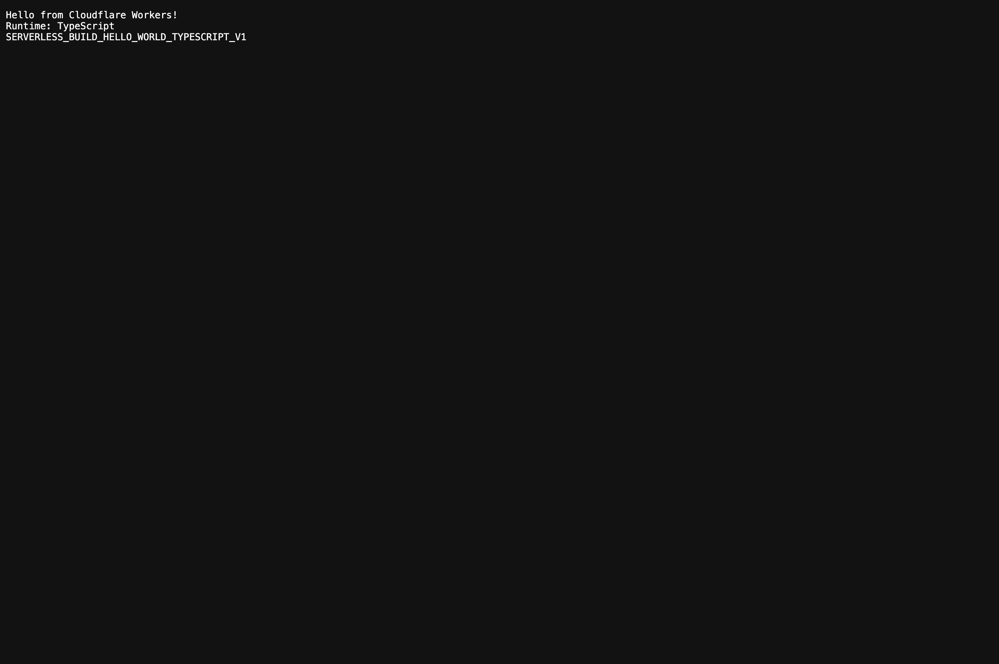
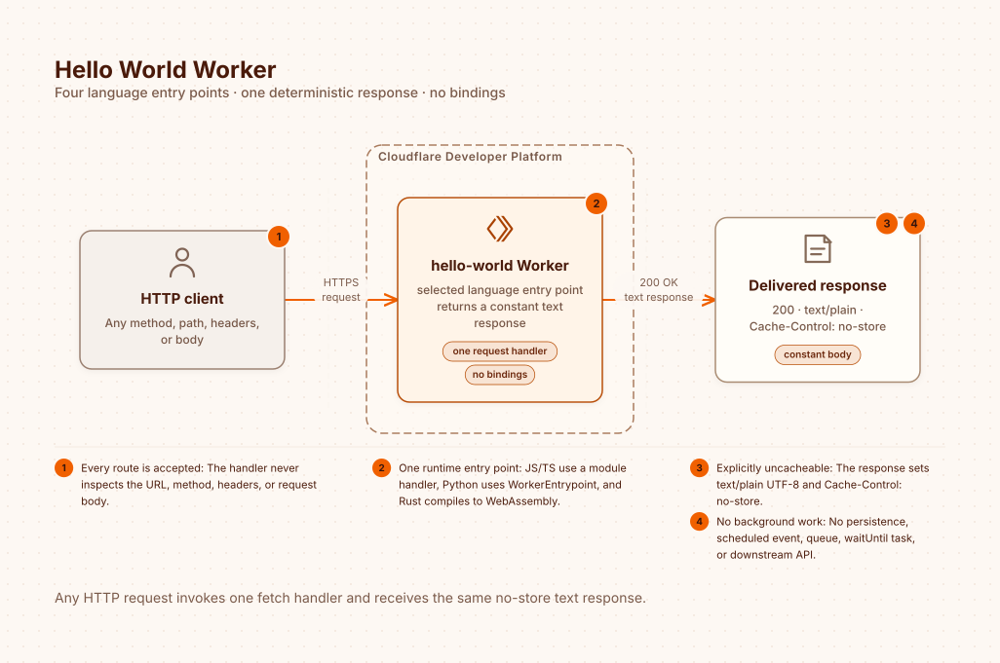
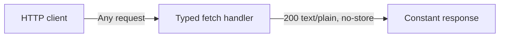

# Hello World Worker - TypeScript and Wrangler

[](LICENSE)

> A minimal Cloudflare Worker in TypeScript with local development and deployment through Wrangler or the beta Cloudflare CLI.

> **Status:** Reference sample shared as-is. Not actively maintained; support is best-effort through [GitHub Issues](../../issues).

[Live demo](https://workers-hello-world-typescript.dwarven.workers.dev) · [Interactive pattern](https://serverless.build/patterns/hello-world-worker?language=typescript&framework=none&deploy=wrangler)

[](https://deploy.workers.cloudflare.com/?url=https://github.com/Serverless-Build/workers-hello-world-typescript)



## Architecture





The handler runs at the edge without an origin, database, or binding. The checked-in [architecture brief](docs/architecture/hello-world-worker.yaml) describes the shared diagram.

## Pattern At A Glance

| | |
|---|---|
| Difficulty | Beginner |
| Build time | 3 minutes |
| Runtime | Cloudflare Workers |
| Language | TypeScript |
| Framework | No framework |
| Data store | None |

## What It Implements

- A typed module Worker with one `fetch` handler.
- Explicit plain-text and no-store response headers.
- A TypeScript verification marker for deployment checks.

## Where It's Applicable

- Confirming a typed Workers development environment.
- Learning the smallest useful `ExportedHandler` implementation.
- Verifying a deployment before adding routes or bindings.

## How It Works

1. A request reaches the Worker at the edge.
2. The typed `fetch` handler creates a constant response.
3. Cloudflare returns it without contacting an origin.

## Prerequisites

- Node.js 22 or later.
- A Cloudflare account for deployment. The [interactive pattern](https://serverless.build/patterns/hello-world-worker?language=typescript&framework=none&deploy=wrangler) also offers a temporary account when supported.

## Setup

Clone `https://github.com/Serverless-Build/workers-hello-world-typescript.git`, enter the repository, and run `npm ci`. No environment variables or bindings are required. `wrangler.jsonc` configures the default deployment; `cloudflare.config.ts` configures the beta `cf` recipe.

## Run Locally

Run `npm run dev`, then open `http://localhost:8787`.

## Deploy Remotely

Authenticate Wrangler and run `npm run deploy`.

## Test Locally

Run `npm run check`, then request `http://localhost:8787/` with `curl -i` and confirm the response contains `SERVERLESS_BUILD_HELLO_WORLD_TYPESCRIPT_V1`.

## Test Remotely

Request the URL printed by Wrangler and confirm it contains the same marker.

```text
Hello from Cloudflare Workers!
Runtime: TypeScript
SERVERLESS_BUILD_HELLO_WORLD_TYPESCRIPT_V1
```

## Alternative deployment recipes

- **Cloudflare CLI (beta):** `npm run cf:build`, `npm run cf:check`, then `npm run cf:deploy`; authenticate with `npx cf auth login` before deployment. This path uses Vite and `cloudflare.config.ts`. Choose a separate Worker name if you also maintain the Wrangler deployment.
- **Terraform:** Follow [terraform/README.md](terraform/README.md) to compile the same source to JavaScript and deploy it under a separate name.

## Project structure

`src/index.ts` is the complete handler; `tsconfig.json` checks its types; `wrangler.jsonc` and `cloudflare.config.ts` configure deployment; `vite.config.ts` builds the beta CLI recipe; `terraform/` is an independent IaC recipe; `docs/` contains the architecture and live screenshot. No secrets are required.

## Other languages

[JavaScript](https://github.com/Serverless-Build/workers-hello-world-javascript) · [Python](https://github.com/Serverless-Build/workers-hello-world-python) · [Rust](https://github.com/Serverless-Build/workers-hello-world-rust)

## Contributing, support, and license

See [CONTRIBUTING.md](CONTRIBUTING.md), [SUPPORT.md](SUPPORT.md), and [SECURITY.md](SECURITY.md). Licensed under [MIT-0](LICENSE). Inspired by the [Cloudflare Workers getting started guide](https://developers.cloudflare.com/workers/get-started/guide/).

## Cleanup

Run `npx wrangler delete workers-hello-world-typescript`.

## Watch Out For

- The example intentionally has no authentication, persistence, or routing.
- Keep generated binding types in sync after adding bindings.

## Production Fit

This is a deployment smoke test, not a complete production application. Add application-specific security, observability, error handling, and tests before using it for real traffic.
